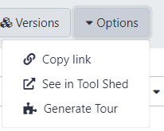
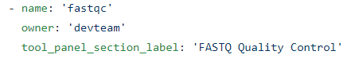
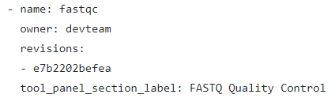

# Avans ATGM Galaxy Installed Tools

## Requesting Tools in the ATGM Galaxy

Policies are not set in stone and we would be happy to seek feedback and discussions.

Currenty, we encourage everyone to submit tools via PRs to this repo. The tools are losely grouped into several categories based on the yaml files. Please make your changes in the appropriate file and avoid creating a new yaml file unless necessary.

However, we promise a high-quality service to our users and we need to ensure
sustainability of the installed tools. That means that tools are regularly
updated, tested and can be adjusted to new developments.  Therefore, we
encourage everyone to follow the [IUC Guidelines](https://galaxy-iuc-standards.readthedocs.io/en/latest/index.html)
for tool development and have automatic testing enabled via
[CI](https://en.wikipedia.org/wiki/Continuous_integration).

We encourage you to submit your tool to one of the larger community repositories, like

 * [Galaxy Tools maintained by IUC](https://github.com/galaxyproject/tools-iuc)
 * [Björn Grüning repo](https://github.com/bgruening/galaxytools)
 * [Galaxy Proteomics repo](https://github.com/galaxyproteomics/tools-galaxyp)
 * [EI repo](https://github.com/TGAC/earlham-galaxytools)
## How to request Tools in Galaxy using Github. 

Your tool isn’t installed in http://galaxy.bioinformatics-atgm.nl/ ?  

( Step-by-Step tutorial here: [Step-by-Step](./Step-by-step_tutorial.md) )

### Overview installing new tool: 

1.	Check if tool is available on https://usegalaxy.eu/ 

```
Yes: Select 'See in Tool Shed' in the tool menu
```



2.	Check if tool is available on https://toolshed.g2.bx.psu.edu/ 
If tool is available:

* Get name + owner information from toolshed (name + owner)
* Get tool_panel_section_label information on https://usegalaxy.eu/ 

3.	Add tool in https://github.com/Avans-ATGM/installed-tools/blob/master/tools.yaml 



4.	Create a new branch for this commit and start a pull request. (this can take a day or two)


### If specific version is needed: 

*(TOOL MUST ALREADY HAVE BEEN ADDED TO TOOLS.YAML)*

5.	Check revision number of specific version in toolshed

6.	Add tool in https://github.com/Avans-ATGM/installed-tools/blob/master/tools.yaml.lock 

 

7.	Create a new branch for this commit and start a pull request. (this can take a day or two)

Or check the Step-by-Step tutorial here: [Step-by-Step](./Step-by-step_tutorial.md)
