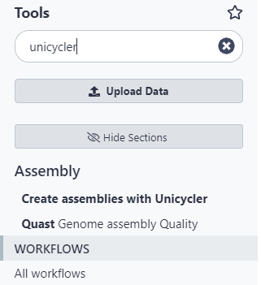
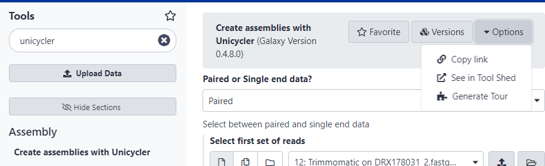
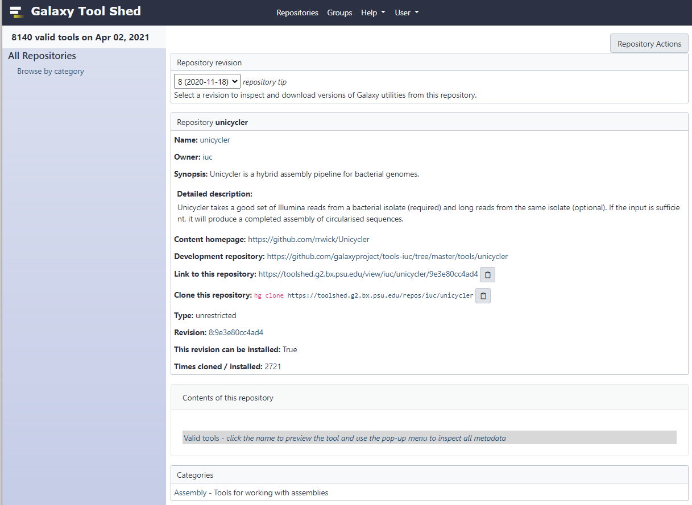
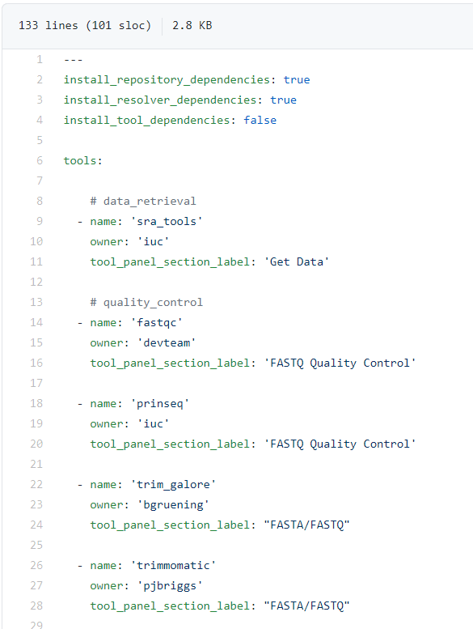
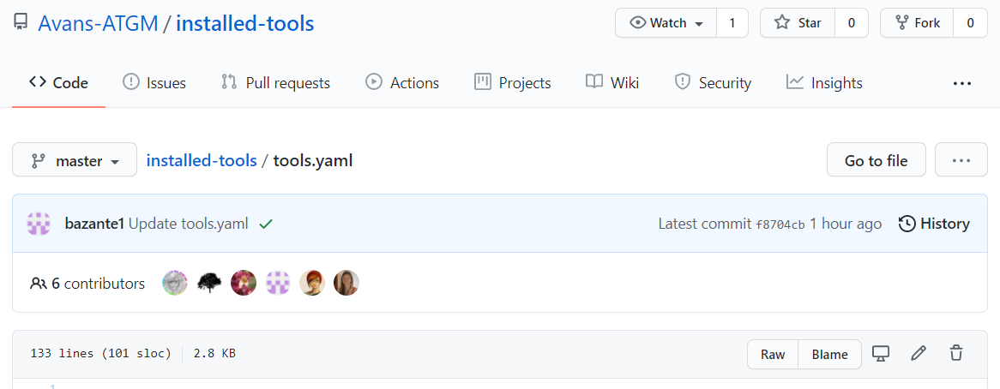
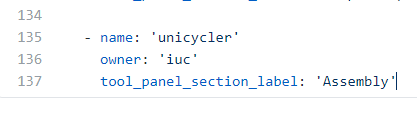
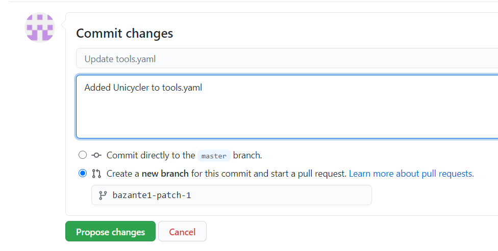
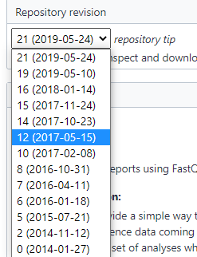
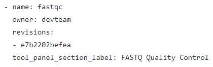

# How to request Tools in Galaxy using Github. 

Your tool isn’t installed in http://galaxy.bioinformatics-atgm.nl/ ?  

### Overview installing new tool: 

1.	Check if tool is available on https://usegalaxy.eu/ 

```
Yes: Select 'See in Tool Shed' in the tool menu
```


2.	Check if tool is available on https://toolshed.g2.bx.psu.edu/ 
If tool is available:

* Get name + owner information from toolshed (name + owner)
* Get tool_panel_section_label information on usegalaxy.eu

3.	Add tool in https://github.com/Avans-ATGM/installed-tools/blob/master/tools.yaml 


4.	Create a new branch for this commit and start a pull request. (this can take a day or two)

### If specific version is needed: 

*(TOOL MUST ALREADY HAVE BEEN ADDED TO TOOLS.YAML)*

5.	Check revision number of specific version in toolshed

6.	Add tool in https://github.com/Avans-ATGM/installed-tools/blob/master/tools.yaml.lock 

 

7.	Create a new branch for this commit and start a pull request. (this can take a day or two)

# Step by Step Installation

1.  Check if your tool is available on https://usegalaxy.eu/ 



2.  Select the tool and click options in the top right corner and select “See in Tool Shed”



**Here you’ll find all the information you need later!**

3.  Now go to https://github.com/Avans-ATGM/installed-tools/blob/master/tools.yaml 
**Here you can find an overview of allmost all installed tools and is needed to add tools**



4.  First check if your tool is already in this file!

```
If not: go back to the tool information at https://toolshed.g2.bx.psu.edu/ <br>
If exists, but not installed. Wait a day and if still not exists, please contact administator. 
```

5. Here you should collect the name and owner of the tool. <br>
6. Collect the section information in http://usegalaxy.eu 

7. Now click on the :pencil2: to edit the file.



8.	Scroll down and copy paste one of the earlier added tools, and replace the text to mach yours. *(To make sure you use the right layout)*



9.  When finished adding all the tools you need to create a new branch and write a description what you changed.  


### Installing specific revision of a tool.

**If it’s needed to install a specific (older) version of a tool, first (if not already exists) add the tool as described before to the tools.yaml file.**

10. Go to the toolshed page from your tool and select your specific version/revision. Each revision has its own revision number




11. Now open the https://github.com/Avans-ATGM/installed-tools/blob/master/tools.yaml.Lock file and (if not yet exists) add your tool. If exists just add your revision.



**NOTE:** *one tool can have multiple revisions*

12. Now start a pull request and add in the description what you have changed.


13. Now wait for one to two days, and your tool should be installed automatically!
